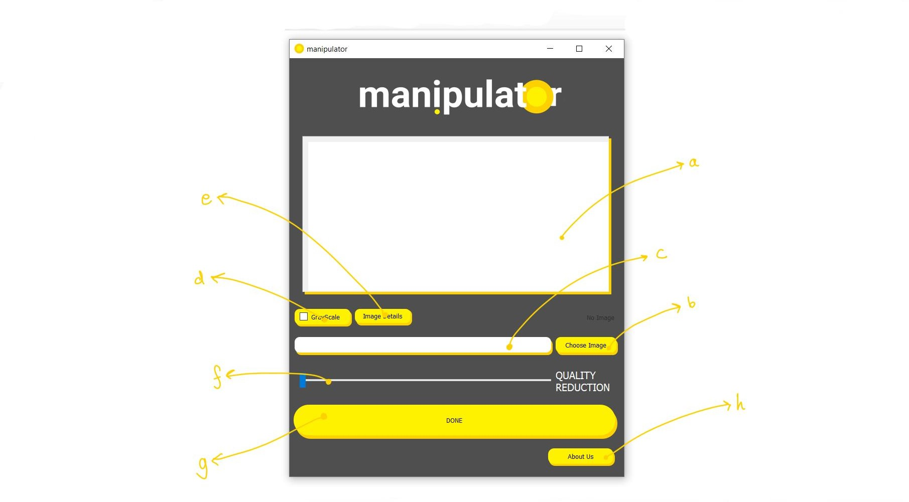

# Manipulator
An image manipulation executable software for image size reduction. 

[Click here](https://drive.google.com/file/d/1F5pJouOuhVHuOn3qmC8-mNS2V8WU135O/view?usp=sharing) to download "manipulator.zip".

## Steps to use the software
1. Download the zip file from the above link; extracct it; double click on "manipulator.exe".
2. Usage:

  a. This is where the choosen image will be displayed.
  
  b. This button allows one to choose the image that has to be operated upon, which will be displayed at (a).
  
  c. Here the path of the choosen image will be displayed.
  
  d. This checkBox allows one to convert the image into grayscale (or black&white).
  
  e. This buttons allows one to see size details of the image.
  
  f. This scroller allows one to choose how much size is to be reduced. Initially its 0% and maximum is 99%. 
  
  g. This button finally operates the images and saves the image in the folder/directory where the original image was.
